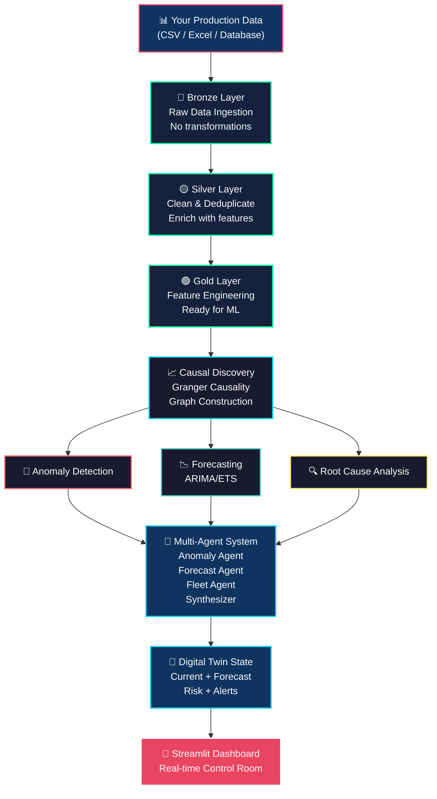
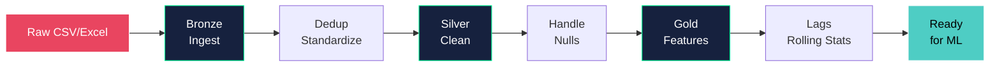
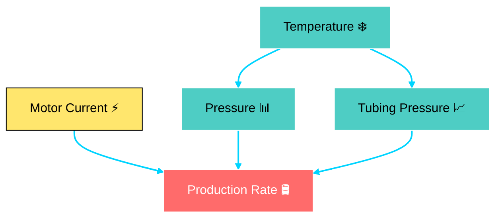
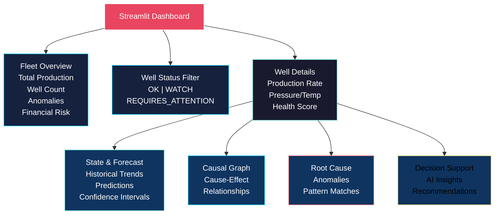

# ⛽ Causal Production Intelligence Digital Twin

[](https://www.python.org/downloads/)
[](https://streamlit.io/)
[](#)

**AI-powered anomaly detection, root cause analysis, and predictive forecasting for upstream oil & gas production optimization.**

A production-ready digital twin framework that uses causal inference, multi-agent AI, and time-series forecasting to detect production anomalies, identify root causes, and enable real-time operational intelligence at the well and fleet level.

---

## 🎯 Overview

Managing oil & gas production data is complex. Production engineers need to:
- **Detect anomalies** before they cascade into downtime
- **Understand root causes** to take corrective action fast
- **Forecast trends** to plan maintenance and optimize operations
- **Monitor entire fleets** without drowning in alerts

This project solves all four. It ingests well production data, discovers causal relationships between variables, detects anomalies using those causal patterns, forecasts production trends with confidence intervals, and presents everything in a professional real-time control room dashboard.

**Designed for:** Production engineers, operations teams, digital transformation leads, and anyone optimizing E&P asset performance.

---

## ✨ Key Features

### 🔍 Causal Anomaly Detection
- Uses **Granger causality** to identify temporal cause-effect relationships in production data
- Discovers root causes automatically, not just statistical thresholds
- Builds dynamic causal graphs showing system interactions

### 📈 Production Forecasting
- Multi-step ahead production predictions with confidence intervals
- Health index forecasting to predict well degradation
- Automatic model selection (ARIMA, exponential smoothing)
- Real-time forecast updates as new data arrives

### 🚨 Root Cause Analysis
- Matches detected anomalies to known cause patterns
- Generates actionable explanations for production deviations
- Prioritizes wells requiring immediate attention

### 🤖 Multi-Agent Decision Support
- Specialized AI agents analyze different aspects (anomalies, forecasts, fleet status)
- Synthesizer agent combines insights into coherent recommendations
- Explainable decision chains for operational transparency

### 📊 Fleet Monitoring Dashboard
- Real-time production rates and health scores
- Watch lists and anomaly flags
- Financial risk tracking ($ per day at risk)
- Causal graph visualization
- Individual well detailed views

### 🏗️ Production-Ready Architecture
- Clean data pipeline: Bronze → Silver → Gold layers
- SQLite backend for reliability
- Modular, extensible code structure
- Runs in Google Colab or local environment
- Full data lineage and audit trails

---

## 🏗️ System Architecture



---

## 🔄 Data Pipeline Flow



---

## 🧠 Causal Discovery Example



---

## 🚀 Quick Start

### Option 1: Google Colab (Recommended - No Setup)

No installation needed. Everything runs in the cloud.

1. **Open the notebook in Colab:**
   - Upload `Causal_Digital_Twin.ipynb` to Colab

2. **Run all cells:**
   - `Runtime → Run all` (or Ctrl+F9)
   - Wait for dependencies (~2 minutes)

3. **Prepare your data:**
   - CSV with columns: `timestamp`, `well_id`, `production_rate`, `pressure`, `temperature`, `motor_current`, etc.
   - Upload via Colab's file browser

4. **Run the pipeline:**
   - Specify data path in config cell
   - Execute pipeline cells

5. **Launch Streamlit dashboard:**
   - Click the public URL provided by Colab
   - View your digital twin in real-time

**Zero setup. Zero Docker. Just run.**

### Option 2: Local Environment

For advanced users with full control.

```bash
# 1. Clone the repository
git clone https://github.com/yourusername/causal-digital-twin.git
cd causal-digital-twin

# 2. Create virtual environment
python -m venv venv
source venv/bin/activate
# On Windows: venv\Scripts\activate

# 3. Install dependencies
pip install -r requirements.txt

# 4. Prepare data
# Place your CSV in: data/raw/production_data.csv

# 5. Run the pipeline
python pipeline/run_pipeline.py

# 6. Launch Streamlit dashboard
streamlit run app/dashboard.py

# Dashboard opens at http://localhost:8501
```

---

## 📦 Installation

### Prerequisites
- Python 3.8 or higher
- pip
- ~500MB disk space

### Full Setup

```bash
git clone https://github.com/yourusername/causal-digital-twin.git
cd causal-digital-twin

python -m venv venv
source venv/bin/activate  # macOS/Linux
# or
venv\Scripts\activate     # Windows

pip install --upgrade pip
pip install -r requirements.txt

# Verify installation
python -c "import streamlit; import statsmodels; print('✅ Ready!')"
```

### requirements.txt

```
pandas==2.0.3
numpy==1.24.3
scipy==1.11.2
statsmodels==0.14.0
scikit-learn==1.3.0
streamlit==1.28.0
plotly==5.17.0
sqlalchemy==2.0.21
openpyxl==3.1.2
python-dateutil==2.8.2
reportlab==4.0.7
openai==1.0.0
```

---

## 📖 Usage Guide

### 1. Prepare Your Data

Create a CSV or Excel file with production data:

```csv
timestamp,well_id,production_rate,pressure,temperature,motor_current,tubing_pressure,health_index
2026-05-01 00:00,NOR-A1,586,89.2,45.3,73.9,1921,95
2026-05-01 04:00,NOR-A1,591,89.5,45.1,74.1,1918,94
2026-05-01 08:00,NOR-A1,588,89.1,45.4,73.8,1922,95
```

**Required columns:**
- `timestamp` (datetime)
- `well_id` (string)
- `production_rate` (numeric)
- At least 2 more numeric columns

### 2. Configure the Pipeline

Edit `config.yaml`:

```yaml
data:
  input_path: "data/raw/production_data.csv"
  output_db: "db/production.db"
  timestamp_col: "timestamp"
  well_id_col: "well_id"

pipeline:
  lookback_days: 90
  forecast_horizon: 30
  anomaly_sensitivity: 0.95

causal:
  max_lag: 7
  p_value_threshold: 0.05

forecasting:
  model: "auto"
  confidence_level: 0.95
```

### 3. Run the Pipeline

```bash
# Process all layers
python pipeline/run_pipeline.py

# Or individual steps
python pipeline/bronze.py      # Ingest
python pipeline/silver.py      # Clean
python pipeline/gold.py        # Features
python causal/discovery.py     # Causal analysis
python twin/anomaly.py         # Anomalies
```

### 4. View Results

```bash
# Launch dashboard
streamlit run app/dashboard.py

# Outputs stored in:
# - db/production.db (SQLite)
# - output/forecasts.csv
# - output/anomalies.csv
# - output/causal_graph.json
```

---

## 📊 Dashboard Features

The Streamlit dashboard provides real-time operational intelligence:



### Dashboard Sections

- **Fleet Overview** — Total production, well count, anomalies, financial risk
- **Filter by Status** — OK, WATCH, REQUIRES_ATTENTION
- **Well Details** — Current rates, pressure, temperature, health scores
- **State & Forecast** — Historical trends + predictions with confidence bands
- **Causal Graph** — Visualized cause-effect relationships
- **Root Cause** — Detected anomalies with pattern matching
- **Decision Support** — AI-generated insights and recommendations

---

## 🗂️ Project Structure

```
causal-digital-twin/
├── README.md
├── requirements.txt
├── config.yaml
├── Causal_Digital_Twin.ipynb
│
├── data/
│   ├── raw/                    # Your CSV/Excel here
│   └── processed/
│
├── db/
│   └── production.db           # SQLite database
│
├── pipeline/
│   ├── bronze.py               # Raw ingestion
│   ├── silver.py               # Cleaning
│   ├── gold.py                 # Features
│   └── run_pipeline.py         # Orchestration
│
├── causal/
│   ├── discovery.py            # Granger causality
│   ├── graph.py                # Graph construction
│   └── utils.py
│
├── twin/
│   ├── anomaly.py              # Anomaly detection
│   ├── forecaster.py           # ARIMA/ETS
│   ├── state.py                # Twin state
│   └── root_cause.py           # Root cause analyzer
│
├── agents/
│   ├── base.py                 # Agent framework
│   ├── anomaly_agent.py
│   ├── forecast_agent.py
│   ├── fleet_agent.py
│   └── synthesizer.py
│
├── app/
│   ├── dashboard.py            # Streamlit UI
│   └── components/
│
├── utils/
│   ├── database.py
│   ├── logging.py
│   └── helpers.py
│
├── output/
│   ├── forecasts.csv
│   ├── anomalies.csv
│   ├── causal_graph.json
│   └── reports/
│
└── assets/
    └── dashboard-preview.png
```

---

## ⚙️ Configuration Reference

### config.yaml

```yaml
# DATA
data:
  input_path: "data/raw/production_data.csv"
  output_db: "db/production.db"
  timestamp_col: "timestamp"
  well_id_col: "well_id"
  date_format: "%Y-%m-%d %H:%M:%S"
  timezone: "UTC"

# PIPELINE
pipeline:
  lookback_days: 90              # Historical window
  forecast_horizon: 30           # Days ahead
  min_values_per_well: 48        # Minimum data points
  missing_value_threshold: 0.2   # % allowed
  anomaly_sensitivity: 0.95      # 0=sensitive, 1=strict

# CAUSAL DISCOVERY
causal:
  method: "granger"
  max_lag: 7
  p_value_threshold: 0.05
  test_type: "f_test"

# FORECASTING
forecasting:
  model: "auto"                  # auto, arima, ets
  confidence_level: 0.95
  seasonal: true
  seasonal_periods: 7

# DASHBOARD
dashboard:
  refresh_interval: 300          # Seconds
  theme: "dark"
  timezone: "UTC"

# AI AGENTS
agents:
  enabled: true
  model: "gpt-3.5-turbo"
  temperature: 0.7
  max_tokens: 500
```

---

## 🧠 How Causal Analysis Works

### Why Causal, Not Just Correlation?

**Traditional (correlation):**
- Motor current ↔ Production rate
- Action: ???

**Causal (Granger):**
- Motor current → Production rate (motor drives pump → more production)
- Action: Monitor motor; when it drops, production will follow

### Granger Causality in Plain English

"Variable X Granger-causes variable Y if past values of X help predict Y better than Y's own history."

**Example:**

```
Step 1: Fit model with only past production
        Accuracy = 0.85

Step 2: Fit model with past production + motor current
        Accuracy = 0.92

Step 3: Is 0.92 > 0.85 statistically significant?
        Yes (p-value = 0.012)
        
✅ Motor current Granger-causes production rate
```

### Building the Causal Graph

Test all variable pairs → Find significant Granger causalities → Construct directed graph → Identify root causes

When production drops, trace back through the graph to find the root cause.

---

## 📊 Expected Outputs

After running the pipeline:

### SQLite Database (`db/production.db`)
- Tables: `raw_production`, `clean_production`, `features`, `anomalies`, `forecasts`
- Query with: `sqlite3 db/production.db`

### CSV Reports
- `output/forecasts.csv` — Predictions + confidence intervals
- `output/anomalies.csv` — Detected anomalies + root causes
- `output/root_causes.csv` — Cause frequency and impact

### JSON Outputs
- `output/causal_graph.json` — Causal structure
- `output/twin_state.json` — Current digital twin state

### Interactive Dashboard
- Real-time Streamlit app
- All visualizations and drill-down views
- AI-generated insights

---

## 🔧 Advanced Configuration

### Custom Data Sources

```python
from pipeline.bronze import HistorianConnector

connector = HistorianConnector(
    host="historian.company.com",
    database="production",
    interval_minutes=60
)
data = connector.fetch()
```

### Custom Anomaly Rules

```python
from twin.anomaly import AnomalyDetector

detector = AnomalyDetector()
detector.add_rule(
    name="max_production_exceeded",
    condition=lambda df: df['production_rate'] > 600,
    severity="high"
)
anomalies = detector.detect(data)
```

### Custom Forecasting Models

```python
from twin.forecaster import Forecaster

forecaster = Forecaster()

def custom_model(data, horizon):
    # Your model here
    return predictions

forecaster.register_model("my_model", custom_model)
forecaster.set_model("my_model")
```

---

## 🤝 Contributing

We're actively looking for collaborators! Areas of interest:

### High Priority
- [ ] Additional forecasting models (Prophet, LSTM, XGBoost)
- [ ] More causal discovery methods (PC algorithm, FCI)
- [ ] Real SCADA/historian integrations
- [ ] Cloud deployment (AWS Lambda, Azure, GCP)
- [ ] Advanced visualizations

### How to Contribute

```bash
# 1. Fork the repository
git clone https://github.com/yourusername/causal-digital-twin.git
cd causal-digital-twin
git checkout -b feature/your-feature-name

# 2. Make changes
# - Follow PEP 8
# - Add docstrings
# - Include type hints

# 3. Test locally
pytest tests/

# 4. Push and create pull request
git add .
git commit -m "Add your feature"
git push origin feature/your-feature-name
```

Then create a Pull Request on GitHub describing your changes.

---

## 🎓 Learning Resources

- **Granger Causality**: [Statsmodels Tutorial](https://www.statsmodels.org/stable/examples/notebooks/generated/tsa_causality.html)
- **Digital Twins**: [IEEE Definition](https://ieeexplore.ieee.org/document/8943908)
- **Time Series Forecasting**: [Forecasting Principles & Practice](https://otexts.com/fpp3/)

---

## 💬 Get in Touch

**Interested in collaborating on production intelligence projects?**

I'm actively seeking collaborators, industry partners, and organizations looking to implement AI-driven production optimization. If you're:
- Working in upstream E&P operations
- Building digital transformation initiatives
- Exploring AI/ML solutions for production data
- Looking for AI expertise in your domain

**Let's talk!**

- 🔗 LinkedIn: [Your LinkedIn Profile](https://linkedin.com/in/subhan-ahmed-549a0a25b/)
- 📧 Email: subhaanqureshi302@gmail.com
- 🐙 GitHub: [@yourusername](https://github.com/subhanahmed47)
- 💼 Open to partnerships, consulting, and full-time opportunities

---

## 🔗 Related Projects & Tools

- [Statsmodels](https://www.statsmodels.org/) — Causal inference & time series
- [Streamlit](https://streamlit.io/) — Dashboard framework
- [Plotly](https://plotly.com/) — Interactive visualizations
- [SQLAlchemy](https://www.sqlalchemy.org/) — Database ORM
- [scikit-learn](https://scikit-learn.org/) — Machine learning

---

## 📞 Questions?

- **Issues & Bugs**: [GitHub Issues](https://github.com/subhanahmed47/causal-digital-twin/issues)
- **Discussions & Ideas**: [GitHub Discussions](https://github.com/subhanahmed47/causal-digital-twin/discussions)
- **Direct Contact**: subhaanqureshi302@gmail.com

---

**Built for upstream E&P teams who demand AI they can trust.**

**Version:** 1.0.0 | **Status:** Production Ready | **Last Updated:** July 2026
